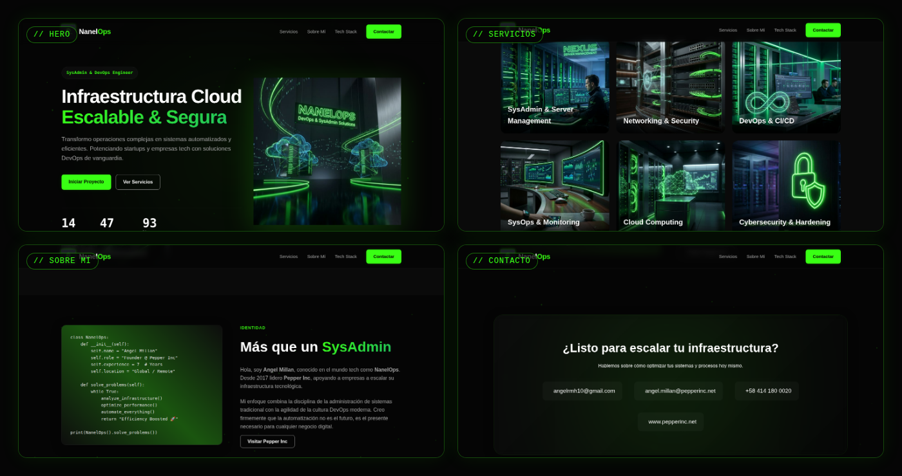

<div align="center">


# >_ NanelOps

[.solve_problems())+%F0%9F%9A%80)](https://git.io/typing-svg)

[](https://www.pepperinc.net)
[](#)
[](#)

<p><i>Estética "Dark Luxury Tech" impulsada por la eficiencia y la automatización.</i></p>

</div>

<br>

<div align="center">

<sub>Capturas reales renderizadas directamente del sitio ⚡</sub>
</div>

<br>

## `$ whoami`

```python
class NanelOps:
    def __init__(self):
        self.name = "Angel Millan"
        self.role = "Founder @ Pepper Inc"
        self.experience = 7  # Years
        self.location = "Global / Remote"

    def solve_problems(self):
        while True:
            analyze_infrastructure()
            optimize_performance()
            automate_everything()
            return "Efficiency Boosted 🚀"

print(NanelOps().solve_problems())
```

Este repositorio es el código fuente del **portafolio oficial de NanelOps**: una *Single-Page Application* que muestra mi trabajo como SysAdmin, arquitecto Cloud e ingeniero DevOps. Nada de plantillas genéricas — el diseño se aleja de lo convencional adoptando una identidad **Dark Luxury Tech**: fondos oscuros y profundos, acentos en verde neón (`#39FF14`) y acabados *glassmorphism*, con la vibra de una terminal de alta gama.

<br>

## ✨ Características

| | |
|---|---|
| 🌌 **Fondo de partículas** | Canvas animado en JavaScript puro, renderizado en tiempo real detrás de cada sección. |
| 🪟 **Glassmorphism** | Tarjetas de cristal esmerilado (`backdrop-filter: blur`) con bordes translúcidos y glow verde neón. |
| 🃏 **Service cards 3D** | 7 tarjetas de servicios con efecto *flip* en `rotateY(180deg)` al hacer hover. |
| 🔢 **Contadores animados** | Estadísticas (`+15 años`, `+50 proyectos`, `99% uptime`) que cuentan al entrar en el viewport vía `IntersectionObserver`. |
| 📱 **100% responsivo** | De monitores *ultrawide* a móviles, con menú *overlay* a pantalla completa. |
| 🧭 **Navbar sticky** | Barra de navegación con efecto *blur* dinámico al hacer scroll. |

<br>

## 🛠️ Stack Tecnológico

<div align="center">


</div>

- **Estructura** — HTML5 semántico
- **Estilos** — CSS3 puro: variables custom, Grid/Flexbox, animaciones `@keyframes`, glassmorphism
- **Lógica** — Vanilla JavaScript: canvas de partículas, `IntersectionObserver`, gestión del menú móvil
- **Tipografías** — `Plus Jakarta Sans` (headings) · `Inter` (body) · `JetBrains Mono` (acentos terminal)

<br>

## 🎨 Paleta de Diseño

<div align="center">

| Token | Hex | Uso | |
|---|---|---|---|
| `--bg-primary` | `#050505` | Fondo base |  |
| `--bg-secondary` | `#0A0A0A` | Secciones alternas |  |
| `--primary` | `#39FF14` | Acento neón / CTA |  |
| `--text-secondary` | `#AAAAAA` | Texto secundario |  |
| `--text-muted` | `#666666` | Texto atenuado |  |

</div>

<br>

## ⚙️ Servicios Destacados en el Sitio

<table>
<tr>
<td width="33%">🖥️ <b>SysAdmin & Server Management</b><br><sub>Linux · Windows Server · Virtualization</sub></td>
<td width="33%">🌐 <b>Networking & Security</b><br><sub>Cisco · Fortinet · Routing · VoIP</sub></td>
<td width="33%">🔄 <b>DevOps & CI/CD</b><br><sub>GitHub Actions · Jenkins · GitLab CI</sub></td>
</tr>
<tr>
<td width="33%">📊 <b>SysOps & Monitoring</b><br><sub>Prometheus · Grafana · Datadog</sub></td>
<td width="33%">☁️ <b>Cloud Computing</b><br><sub>AWS · Azure · Docker · Kubernetes</sub></td>
<td width="33%">🛡️ <b>Cybersecurity & Hardening</b><br><sub>Compliance · Firewalls · Hardening</sub></td>
</tr>
<tr>
<td width="33%" colspan="3">🤖 <b>Scripting & Automation</b><br><sub>Bash · Ansible · Terraform · PowerShell</sub></td>
</tr>
</table>

<br>

## 📂 Estructura de Archivos

```text
📦 nanelops-portfolio
 ┣ 📂 images/               # Assets visuales: logo, hero_visual, iconos de servicios 1-6, preview, etc.
 ┣ 📜 index.html            # Markup principal y contenido del portafolio
 ┣ 📜 styles.css            # Archivo de diseño principal (Tema Dark Luxury)
 ┣ 📜 script.js             # Lógica de interacciones, contadores y partículas
 ┣ 📜 .gitignore            # Exclusiones de control de versiones
 ┗ 📜 README.md             # Esta documentación
```

<br>

## 🚀 Despliegue Local

```bash
git clone https://github.com/NanelOps/web-portafolio-armh-v1.git
cd web-portafolio-armh-v1
# Sin dependencias, sin build step — solo abre index.html
open index.html
```

Este portafolio está arquitectado y preparado para ser desplegado en producción como un subdominio bajo la infraestructura de **[pepperinc.net](https://www.pepperinc.net)**.

<br>

## 📡 Contacto

<div align="center">

[](mailto:angelrmh10@gmail.com)
[](https://wa.me/584141800020)
[](https://www.pepperinc.net)
[](https://www.linkedin.com/in/angelrmh10)
[](https://github.com/angelrmh)

</div>

---

<div align="center">
  <i>"Construyendo infraestructura escalable, segura y automatizada."</i> <br><br>
  <b>Angel Millan / NanelOps</b> · © <span id="year">2026</span>
</div>
